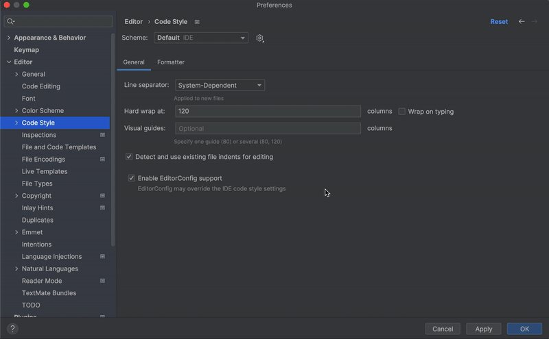
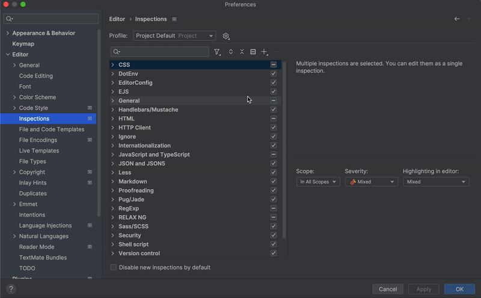

# Paper _code style_ and _inspections_

We ask developers to follow coding conventions across all our projects.

**WebStorm** code style and inspections + **ESLint** work hand-in-hand with each other.

**Be sure to `Fix ESLint Problems`, and `Reformat code` with WebStorm before commit!**

## Requirements
- Latest versions of WebStorm

## Install

### ESLint

1. `npm i https://github.com/paperllc/eslint-config-paper.git{{#semver:^x.x.x|#commithash}} -D`

2. In `.eslintrc.json`

```json
{
    "extends": ["paper"]
}
```

**You will extend only the rules.**

**You need to configure other options by yourself, as well as installing all the dependencies, unless you are working in an existing project with this setup.**

### WebStorm

#### Existing project

Specific files in `.idea` folder are committed, that is why coding conventions are scoped to the project and should already be applied.

#### New project, a project without this setup, or you need to update it

1. Add generated `.gitignore` using [TopTal generator](https://www.toptal.com/developers/gitignore/api/git,node,linux,macos,windows,webstorm)

2. Import code style:
   
   - **Import** `webstorm-code-style.xml` scheme;
   - Then **Copy to Project** (this option to store the selected scheme in a project level.
   The selected code style is saved in the .idea directory in the file codeStyleSettings.xml);
   - Select the project level scheme.

3. Import inspections
   
   - **Import** `webstorm-inspections.xml` profile;
   - Select imported profile and copy it to project level;
   - Select the project level **Paper Inspections n** profile.

4. Ensure that WebStorm listens to LOCAL (project level) settings.
